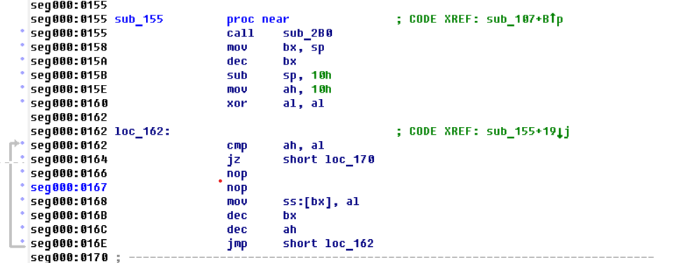

# Отчет о взломе программы

Это отчет о взломе программы, написанной моим коллегой на языке ассемблер в DOSBOX.

Суть заключалась в том, чтобы написать программу, которая проверяет правильность введенного пароля. Автор должен был оставить 2 уязвимости, которые должен найти тот, кто взламывает.

## Используемые программы
Для взлома я пользовался Turbo Debugger из DosBox, IDA - дизассемблер, Visual Studio Code для написания бинарных файлов на ввод.
[Исходный код](https://github.com/coffee8cat/DOS-2-semester/tree/ToCrack)

## Начало программы
1. Программа начинается с того, что вызывается функция по адресу 13Ch, печатающая первую строчку ("Enter password:").

2. Вызывается функция по адресу 2B0h, которая получает текущее время на устройстве и записывает их в буфер по адресу 2E9h

3. В стеке выделяется 10 байт и затем обнуляются

4. В стек кладется 4 байта в обратном порядке с адреса FFF8h по FFF5h: 'a', 'd', 'o', 'y' ("yoda")

5. Вызывается функция посимвольного ввода. Заканчивается, если пользователь введет '0dh' или 18 символов. В зависимости от того, что произошло, программа действует по-разному.

## Первая уязвимость:

Она заключалась в том, что если пользователь введет время на устройстве в момент запуска в формате mm:h (не mm:hh, т.к. был обнаружен баг, что программа проверяет только 4 символа), то программа расценит это как правильный пароль. На самом деле это просто скорее очередной способ получить доступ, а не уязвимость, но автор решил иначе, поэтому она здесь рассматривается именно как уязвимость.

## Вторая уязвимость

Вторая уязвимость была связана с переполнением буфера. Для доступа к переполнению нужно было на ввод предоставить файл, в котором с 13-го по 16-й байты написано "yoda". Если этого не сделать, программа завершается.
Проверив наличие "yoda" программа продолжается и исполняет код. Поскольку буфер со строкой хранится в стеке, то 17-й и 18-й байты по адресу с FFFAh по FFFBh можно переписать. Как упоминалось ранее, в стеке выделялось 16 байт, а до этого буфера лежали 2 адреса возврата. Поэтому 1 адрес возврата можно изменить. Его необходимо изменить на 130h. Это адрес фрагмента кода, где по адресу 153h кладется адрес 1FEh - строчка, уведомляющая об успешном получении доступа. После этого программа завершается.

